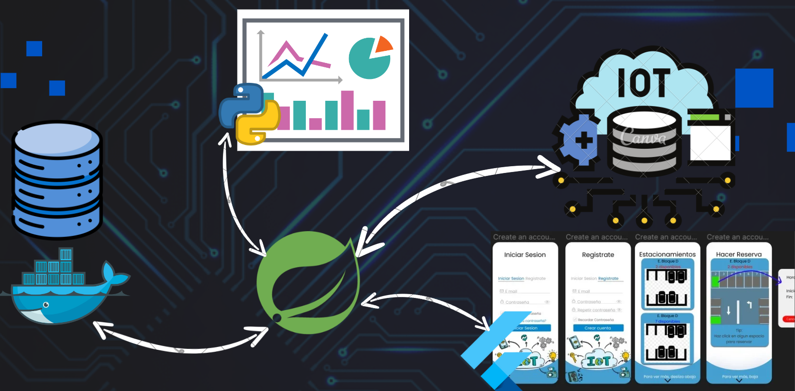
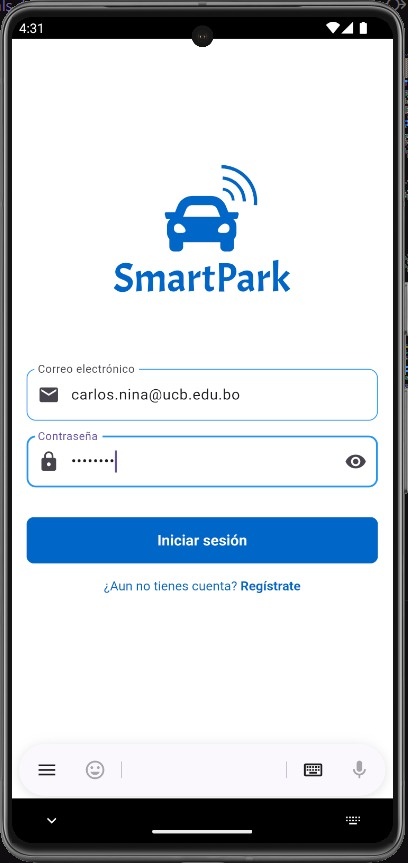
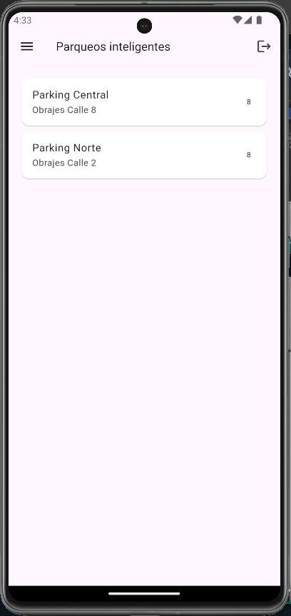
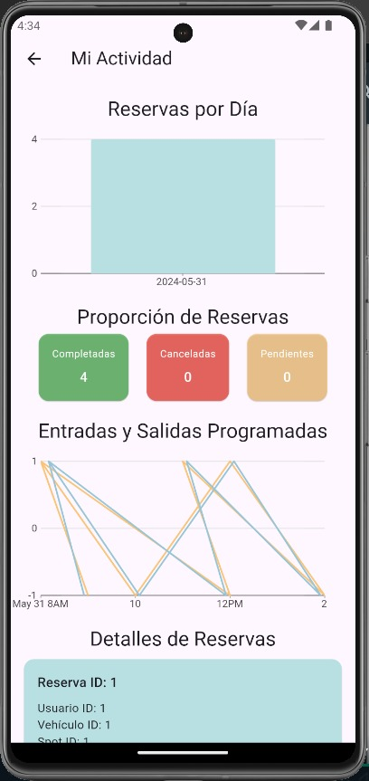
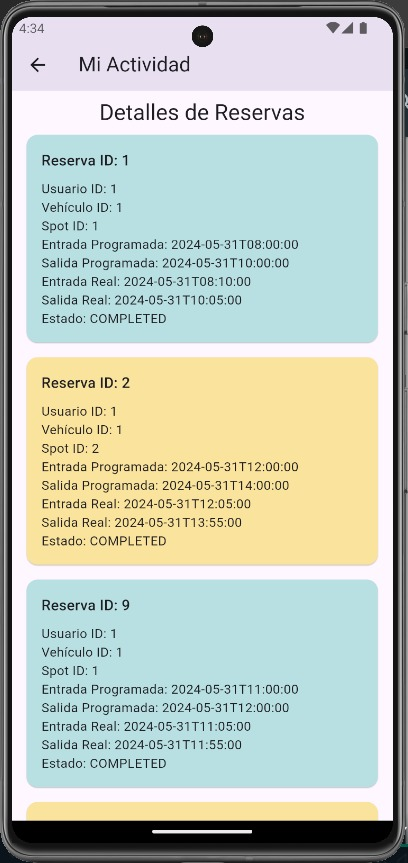
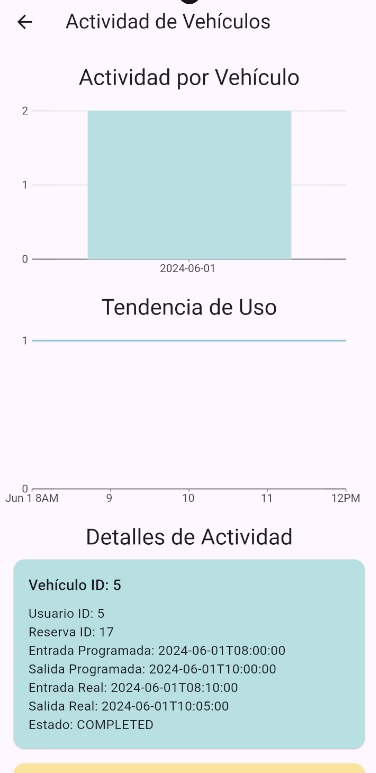
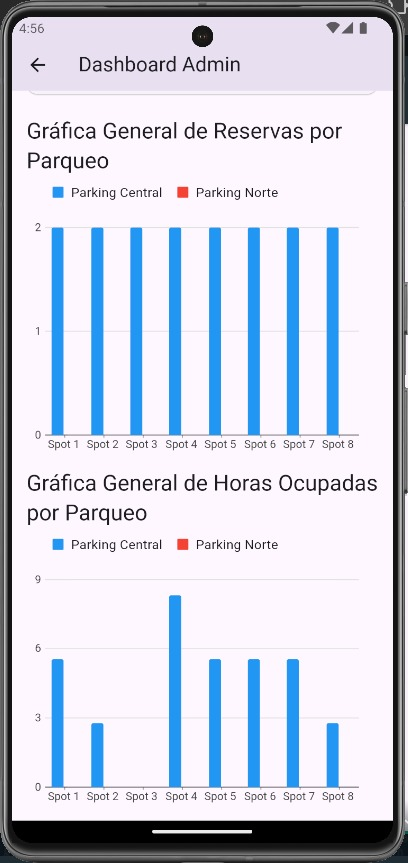
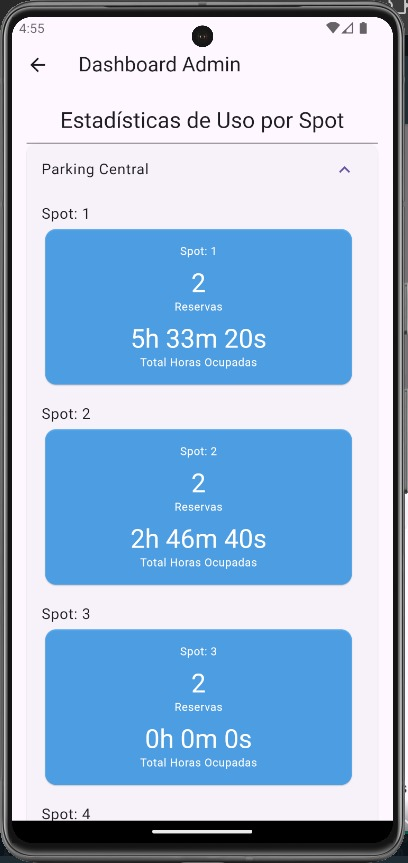
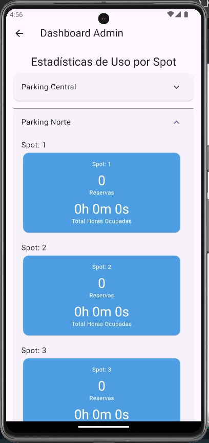

# SmartPark - IoT Garage System

## Index

1. [Problem](#problem)
2. [Proposed Solution](#proposed-solution)
3. [Objective](#objective)
   - [Workflow](#workflow)
   - [Project Differentiator](#project-differentiator)
   - [Views](#views)
4. [Technologies Used](#technologies-used)
5. [Contribution](#contribution)
6. [Functionality](#functionality)
7. [System Operation](#system-operation)
8. [Key Components](#key-components)
9. [Potential Problems](#potential-problems)
10. [Queries and Graphs](#queries-and-graphs)
11. [Development](#development)
    - [Programs Used](#programs-used)
    - [Docker Image Initialization](#docker-image-initialization)
    - [Backend Structure](#backend-structure)
    - [Frontend Structure](#frontend-structure)
12. [Conclusions](#conclusions)
13. [Running the Project](#running-the-project)

## Problem

Managing parking spaces in university campuses is chaotic and inefficient, leading to congestion and security issues.

## Proposed Solution

An intelligent garage system utilizing ultrasonic sensors, keypad authentication, and a mobile app for real-time management and monitoring.

## Objective

Optimize and automate real-time parking space management to enhance efficiency and security for users while providing statistical data for the university.

### Workflow

1. **Vehicle Detection at Entry**
2. **Vehicle Authentication**
3. **Space Assignment**
4. **Garage Access**
5. **Continuous Monitoring**
6. **User Interface**

## Project Differentiator

- Complete and Automated Integration
- Use of Modern Technologies (Raspberry Pi Pico W, Flutter, Spring Boot)
- Flexible Authentication Methods (Code and License Plate Recognition)
- Intuitive Mobile Application
- Advanced Security Measures

## Technologies Used

- **Spring Boot (Java Backend)**
- **Flutter (Frontend)**
- **PostgreSQL (Database)**
- **Python (IoT Nodes and Dashboard)**




### Views

1. **Login**





2. **Registration** for the user and their car


3. **Parkings - Available Spaces**: Parking Central




4. **Space Reservation**
   Choose a car and the time for your reservation


5. **Vehicle Registration**
   Add a vehicle


6. **User Activity**:
   - Reservations that have been made
   - Entry and exit time graph for a reservation



7. **Reservation Details**:
   - User, vehicle, entry and exit programmed, exact (real) entry and exit, status of the reservation



8. **Vehicle Activity Graph**:

- Usage tendency for a vehicle



9. **Admin Dashboard on Flutter App**:

   - Relevant information directly on your phone
   - Statistics per use by spot
   - Reservations by spot
   - Total hours occupied by parking and spot





10. **Python Dashboard for ADMIN**:
    - KPIs from the parking usage and the most relevant information for an ADMIN user


## Contribution

- **Improved Efficiency**
- **Enhanced Security**
- **Automation and Convenience**
- **Real-Time Monitoring**
- **Resource Optimization**

## Functionality

- **Detection of Available Spaces**
- **Access Control**
- **Automatic Space Assignment**
- **Physical Access Control**
- **Monitoring and Notifications**

## System Operation

### Key Components


- Raspberry Pi Pico W
- Presence Sensors
- Keypad
- Servo Motor
- Motion Sensors
- WiFi Modules
- Supabase Cloud Database

## Potential Problems

- Accuracy of Space Detection
- System Security
- Response Time
- Connectivity and Synchronization

## Queries and Graphs

- Comparison of Entry and Exit Times
- Reservation Usage
- Parking Occupancy
- Space Demand

## Development

### Programs Used

- **Flutter**: 3.19.6
- **Spring Boot**: 3.0
- **Python + MicroPython**
- **PostgreSQL**: 15.3
- **Java SDK**: 20

### Docker Image Initialization

To initialize the Docker image for the PostgreSQL database:

```bash
docker run -d --name smartpark_c -e POSTGRES_PASSWORD=12345 -e POSTGRES_USER=admin -e POSTGRES_DB=smartpark_db -p 5432:5432 postgres:15.3
```

### Backend Structure

- **Entity**: `UserEntity.java`
- **Repository**: `UserRepository.java`
- **Controller**: `UserController.java`
- **DTO**: `UserDTO.java`
- **BL**: `OrderLogic.java`
- **DB**: `MySQLDatabase.java`
- **Services**: `AuthService.java`

### Frontend Structure

- **Config**: `routes.dart`
- **Models**: `user_model.dart`
- **Providers**: `user_provider.dart`
- **Styles**: `theme.dart`
- **Services**: `api_service.dart`
- **Utils**: `constants.dart`
- **Views**: `home_screen.dart`
- **Widgets**: `custom_button.dart`

## Conclusions

The system optimizes the parking experience in university campuses using advanced technologies and secure authentication, improving efficiency and security for users and providing useful data for decision-making.

## Running the Project

1. To run the database in a Docker container, use the following command:

```bash
docker run -d --name smartpark_c -e POSTGRES_PASSWORD=12345 -e POSTGRES_USER=admin -e POSTGRES_DB=smartpark_db -p 5433:5432 postgres:15.3
```

2. Navigate to "backend\bd\smartpark.sql" and execute the database along with the test data (INSERTS).

3. In the "backend\" directory, run Spring Boot:

```bash
mvn clean install spring-boot:run
```

4. The URLs in the Python scripts for entry_node and space_nodes should point to the backend IP address and the default port 8080 currently running on the backend.

5. Ensure firewall ports have rules to allow external connections, such as IoT nodes via WiFi to port 8080 from the backend server. The network needs a router or mobile device as a router to function correctly and serve the IoT nodes.

6. Configure secrets.py with the necessary credentials to connect to the router for proper functionality.

7. Once the IoT network connection is established, proceed with the project.
