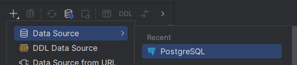
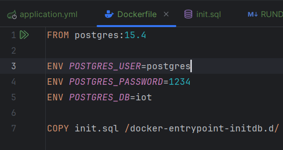
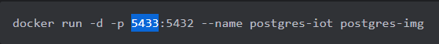
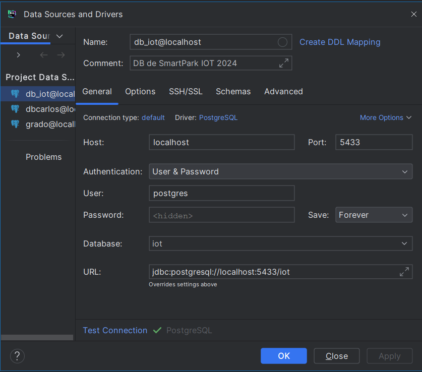
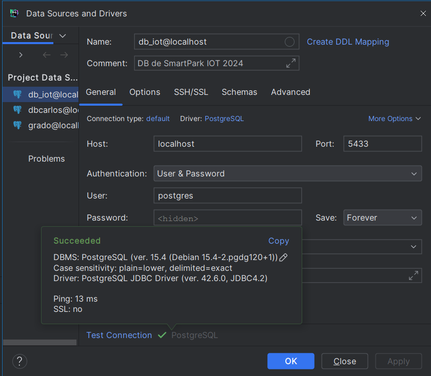

### Instalación de la base de datos

Tienes que esta en la dirección:
iot_garaje_inteligente\backend>

Dentro de la carpeta "backend" y correr:

1. Construir una imagen en base al documento docker, ubicado en el directorio "docerAndDataBase"

```
docker build -t postgres-img ./docker_and_data_base
```

2. Crear un contenedor en base a la imagen

```
docker run -d -p 5433:5432 --name postgres-iot postgres-img
```

3. Conectarse a la base de datos mediante consola

```
docker exec -it postgres-iot psql -U postgres -d iot
```

3.1 Para salir:
```
quit
```

3. Alternativamente se puede contectar mediante DataGrip, PgAdmin, Debeaver, etc

### Ejemplo con DATA grip
4. Crear Conexion con PostgreSQL



5. Colocar las credenciales adecuadas, en este caso fueron:
- Name, Comment son irrelevantes, pueden ser cualquiera
- Host: localhost
- User: postgres(Dockerfile)
- Password: 1234(Dockerfile)
- Database: iot(Dockerfile)

Credenciales:


- Port: 5433(el puerto de la izquierda según comando docker del paso 2)


 

### Así se vería aplicado:



6.  Test Connection

7. Darle click al boton Apply y se guarda la conexión para poder usar la consola dentro de esta base de datos ya conectada

¿Que hace todo esto?:
  Crea un contenedor de docker que actua como una base de datos según el Dockefile y hace correr el **init.sql** y si hay
  datos en ella como una base de datos, la crea, si hay inserts, los inserta,etc

